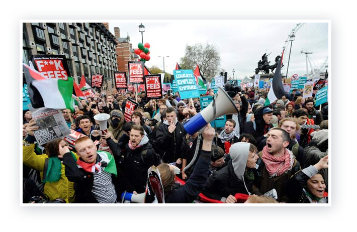

# Fight for the Future: the website 

Lots of work is being done to make it as easy as possible to update content on
fightforthefuture.org. It's still a work in progress, but progress is being
made! Content is, as a general rule, meant to be able to be written in
[markdown][a1]. In the long run, there will be several layouts available in
`site/_layouts` which can be thought of as campaign templates. This README will
grow with documentation written on a per-template basis. The templating language
we use here is called [liquid][a2], which gives you lots of power without
requiring knowing a coding language in the traditional sense. There are also
some [custom liquid tags][a3] available just for Fight for the Future. They were
written to go along with the templates that Vasjen designed.

_the following directions will apply for about 95% of new pages._

[a1]: http://kramdown.gettalong.org/quickref.html
[a2]: https://github.com/Shopify/liquid/wiki/Liquid-for-Designers
[a3]: #custom-tags

***

**TODO:**

- [ ] Independent instructions for each layout
- [ ] \(…build each layout)

***

## Changing evergreen pages

Most evergreen pages are set up or being set up for easy editing from the
`site/_data` directory. One important thing to note about editing Yaml (yml)
files is that whitespace (or indentation) matters. If you want to double-check
whether your yaml is valid, there’s a [great service for checking syntax][b1].

[b1]: http://codebeautify.org/yaml-validator

### Homepage

#### Adding new projects

Adding new content to the homepage can be done by editing the
`site/_data/homepage.yml` file. To add a project, find `fftf:` or `fftfef:`,
whichever is applicable. A new project should look like this does below:

```yaml
  - id: faxbigbrother
    fire: true
    url: https://wwwfaxbigbrother.com/
    image: 'homepage/images/projects/fax.png'
    title: '#FaxBigBrother to stop CISA'
    description: 'Congress is stuck in 1984, so we helped Internet users generate 6 million faxes to stop the worst spying bill yet.'
```

| Option      | Type   |                                                    |
| :---------: | :----: | :------------------------------------------------- |
| id          | string | should be one word, no spaces                      |
| fire        | boolean| optional. true if it gets the little fire graphic. |
| url         | string | link to project.                                   |
| image       | string | path, without domain, to image                     |
| title       | string |                                                    |
| description | string | should be kept to one paragraph                    |

#### Adding to “Other Links”

Under the `otherLinks:` section for Fight for the Future links, and
`otherLinksc3:` for Center for Rights, links require the url, as well as the
text of the link itself.

```yml
  - text: Defund the NSA
    url: http://DefundTheNsa.com
```

#### Adding to featured press on homepage

The home page has two different categories of link under the `featuredpress:`
section of `site/_data/homepage.yml`. `detail:` refers to the pull-quote-like
coverage we have singled out. The page itself is only set up for three different
quotes, so please make sure to remove one when you’re editing. Those sections
require the quote itself and the title of the publication.

```yml
    - quote: This movement started from somewhere. The group behind the largest online protest in history is Fight for the Future, which began in October.
      publication: San Francisco Chronicle
      link: http://www.sfgate.com/news/article/The-Largest-Online-Protest-In-History-Started-Here-2629811.php
```

```yml
    - url: http://edition.cnn.com/2012/05/29/tech/web/internet-defense-league/
      publication: CNN
```

### Press

The press page is automatically generated from a list in
`sites/_data/press.yml`. All the links are sorted by campaign first—i.e. Net
Neutrality, SOPA, etc. Once you've found your campaign, you can create a new
link by duplicating the sample below (or any sample in the document really) and
replacing the `title:`, `date:`, `publication:`, and `link:` lines.

```yml
    - title: 'Not Everyone Thinks T-Mobile’s ‘Binge On’ Streaming Is a Good Idea'
      date: 2015-11-13
      publication: NBC News
      link: http://www.nbcnews.com/tech/mobile/not-everyone-thinks-t-mobiles-binge-streaming-good-idea-n461066
```

**If you wish to add a new campaign to the press page**, you’ll be adding a
whole new section at the top of the document. The line labeled `campaign:`
should be all lower-case, with no spaces. A sort of identifier for it. `pretty:`
will be the actual heading on the press page. Under `coverage:` is where you‘ll
add the rest of your links. Attempting to add a new campaign without any links
to go with it will break the page, so please avoid that.

```yml
- campaign: 'nn'
  pretty: 'Net Neutrality'
  coverage:
    - title: 'Not Everyone Thinks T-Mobile’s ‘Binge On’ Streaming Is a Good Idea'
      date: 2015-11-13
      publication: NBC News
      link: http://www.nbcnews.com/tech/mobile/not-everyone-thinks-t-mobiles-binge-streaming-good-idea-n461066
```


## Creating a new page

To create a new page, create a new file in the `_posts` with a filename in the
following format: `YYYY-MM-DD-my-desired-url.md`. You can create HTML or
Markdown format files. In order to be processed into a web page, the software
requires some content at the top of the page known as “front matter”. In its
simplest form, front matter looks like this:

```yml
---
layout: none
---
```

It’s made up of a line with three hyphens `---`, followed by a list of options
and values for those options, one on each line, followed by another line with
three hyphens. The front matter above will generate the code on the page without
any additional template.

An example of more complex front matter can be seen on the Go Daddy page:

```yml
---
layout: core-only
title: Boycott GoDaddy Over Their Support of SOPA & PIPA
description: Pledge to transfer your domains from GoDaddy in response to their support of SOPA & PIPA.
share:
  title: "GoDaddy Supports SOPA & PIPA. I Won't Support Them."
  image: godaddy.png
  width: 428
  height: 397
  tweet: "GoDaddy supports #SOPA & #PIPA, so I'm not supporting them. I'm transferring my domains. So should you. #BoycottGoDaddy"
class: no-doctype envelope-petition
---
```

For more information on creating new posts, check out the [Jekyll
documentation](http://jekyllrb.com/docs/posts/)

## Front Matter Options

### All posts/pages

| Option      | Type    |  Possible values                | Notes                                                    |
| :---------: | :-----: | :------------------------------ | :------------------------------------------------------- |
| layout      | string  | any filename in `site/_layouts` | _required_ remove `.html` from value                     |
| title       | string  |                                 | If absent, uses title-cased file name less date          |
| description | string  |                                 | Important—used by search engines, twitter, facebook      |
| permalink   | string  |                                 | If page URL should be anything other than its file name  |
| date        | string  |                                 | CSS class added to classlist on body element             |
| class       | string  |                                 | CSS class added to classlist on body element             |
| evergreen   | boolean | true or false                   | True if this is a page that will be referenced long-term |
| share       | object  | See [share][21] table below     |                                                          |
| categories  | array   |                                 | Use 'disallowed' to hide from search engines             |
| changefreq  | string  | See [sitemap changefreq][20]    | Use 'never' for archived pages. Don't use 'always'.      |

### Using “default” layout

Boolean options are assumed to be false when excluded.

| Option        | Type    | Values        | Note                                                             |
| :-----------: | :-----: | :------------ | :--------------------------------------------------------------- |
| header        | boolean | true or false | Determines presence of 160px fftf logo in addition to donate ask |
| footer-topper | boolean | true or false | Determines presence of additional links above footer             |

### Share object

| Option |  Type   | Notes                                                                     |
| :----: | :-----: | :------------------------------------------------------------------------ |
| title  | string  | Can differ from page title. Shows up for twitter & facebook shares.       |
| image  | string  | Filename of a share image that exists in `site/img/share/`                |
| width  | integer | Width of share image. Should be ≥ 1200                                    |
| height | integer | Height of share image. Should be ≥ 630                                    |
| tweet  | string  | Text for default tweet. Should be ≤ 115 characters (url will be appended) |


#### Example `share` object

```yml
share:
  title: "Enjoying your internet freedom? Say thanks by donating today."
  image: fftf-share.jpg
  width: 1400
  height: 553
  tweet: "I just donated to @fightfortheftr, and you should too. Do your part to keep the internet free & open for all."
```

[20]: http://www.sitemaps.org/protocol.html#xmlTagDefinitions
[21]: #share-object

## Globally available Variables

You can include these variables on your page by adding `{{ variable.name }}`
anywhere you wish.


`{{ site.name }}`
: The fallback title for any given page (if one isn’t supplied)

`{{ site.url }}`
: The site URL, including `https://www.`

`{{ site.description }}`
: This is the fallback description

`{{ site.timezone }}`
: Currently set to “America/New_York”

`{{ site.googleanalytics }}`
: Our google analytics property id

`{{ site.favicon }}`
: The path (without the www.fightforthefuture.org part) to favorites/tab icon

`{{ site.author.googleid }}`
: Our Google Plus id

`{{ site.author.twitterid }}`
: Our twitter user number

`{{ site.author.twitter }}`
: Our twitter username

`{{ page.url }}`
: a url relative to the base domain, for example, “/press/”

`{{ page.title }}`
: Either the title that was set in the front matter, or the title-cased filename

`{{ page.slug }}`
: The chunk of the url after the final `/`


## Custom Tags

### `` tag

To be used in situations where some text is hidden with a jump. For example,


Intended usage:

```liquid
Lorem ipsum dolor sit amet, consectetur adipiscing elit. Duis a velit nisl. Cras
ex velit, semper a bibendum in, suscipit eget sem. Donec maximus enim ut rutrum
pellentesque. Morbi ut magna quis dui maximus dignissim in vitae tellus. Fusce
id laoreet arcu, eu iaculis dolor. Phasellus augue ex, aliquet vel consectetur
et, lacinia at dui. Duis justo nunc, cursus ut lacus nec, rhoncus varius arcu.
Duis in pharetra velit.


In eget diam varius, sodales turpis vitae, egestas nunc. Cras nec lacus mi.
Curabitur in libero ipsum. Curabitur at lorem sed arcu egestas venenatis quis ut
purus. Cras pharetra libero at mi rhoncus ultrices. Donec elementum rutrum risus
sed vulputate. Aliquam rutrum lectus dolor, at varius ante elementum eu.
Praesent tincidunt quam eu orci bibendum sagittis porttitor sed ante.

Cum sociis natoque penatibus et magnis dis parturient montes, nascetur ridiculus
mus. Nulla vehicula est quis lectus laoreet, eu egestas libero dignissim. Morbi
lacinia fermentum imperdiet. Duis auctor tortor quis diam egestas, eu tempus
dolor convallis. Nullam erat metus, lobortis a leo ac, convallis tincidunt
ipsum. Sed sed pellentesque quam.

```

`Teaser Text` might be “Read more…” or “Learn More” (no quotation marks
necessary) or whatever you wish. The text starting with `In eget diam…` above
would be the entirety of the text meant to be hidden after a “read more” link.

### `` tag

For use in templates which include a skeumorphic photograph element. For
example,



Intended usage:

```liquid

```

(Note: this tag is self-closing, does **not** require ``)

## Developers:

Here’s a thing—this is not a willy-nilly slapdash combination of underscores, dashes, and camelCase. There is a method to its madness. Underscores are used in Ruby variables. All over the place in `yml` and Liquid. Dashes are used in Less/CSS. Because that is how it is done. And camelCase is BFFs with Javascript. They are meant for each other.

### Frameworks and libraries

- [Composer.js][02] JavaScript MVC
- [Jekyll][03]
- [Grunt.js][04]
- [Liquid templating language][05]

### Installing & running the server

- Install/switch to Ruby 2.2.2 (i recommend using [rbenv][01])
- `gem install bundler` if it’s not already installed
- `npm install` to install packages,
- `npm start` to run grunt (compiles assets, then watches for changes and
compiles those too.)

### Deploying

fightforthefuture.org is hosted on github pages. The site is compiled and then
committed to the `gh-pages` branch every time a commit is made (including merged
pull requests) to `master`. That’s right, committing to `master` automatically
deploys to production. Yee-haw. ^_^

### Code Structure

#### CSS/Less

- All Less files compiled and minified to `public/css/core.css`
- When in doubt, make a new Less file and import it in `core.less`—there’s no
real performance hit as a result of good organization
- Don’t worry about browser prefixes. Grunt handles that too.

#### Javascript

##### This is all aspirational, a boilerplate being applied to a legacy codebase

- `js/main.js` will generally be used to contain the main page logic.
- `js/controllers` will contain all Composer controllers
- `js/models` is there for Composer models and collections
- `js/views` not just for Composer views, but for individual page logic on pages
that have absolutely zero relationship with Composer. Also, regarding Composer
views: use raw markup where you can, for speed.
- This all compiles down to `public/js/core.js` via grunt, which also uglifies
it
- If you’re adding a javascript file that ought to be included in `core.js`,
make sure to add its path to the files array inside the `concat` task in
`Gruntfile.js`

[01]: https://github.com/sstephenson/rbenv
[02]: https://lyonbros.github.io/composer.js/
[03]: http://jekyllrb.com/docs/home/
[04]: http://gruntjs.com/getting-started
[05]: https://github.com/Shopify/liquid/wiki/Liquid-for-Designers

[07]: http://daringfireball.net/projects/markdown/syntax
[08]: https://help.github.com/articles/markdown-basics/
[09]: http://www.pell.portland.or.us/~orc/Code/discount/#Language.extensions
